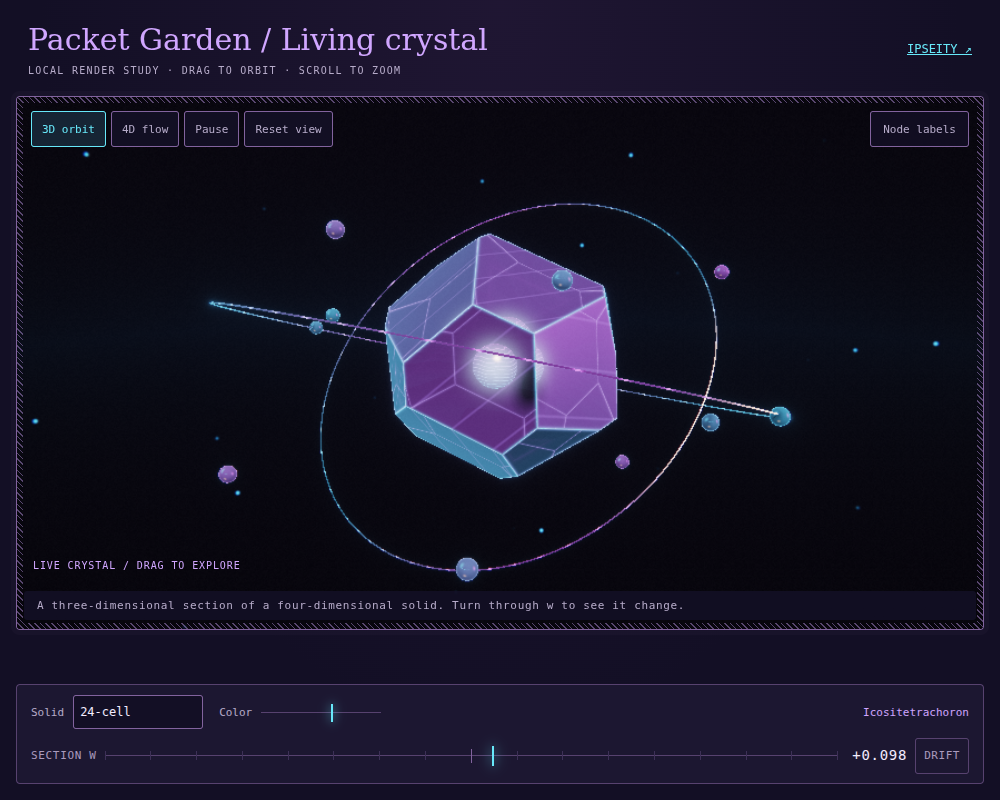
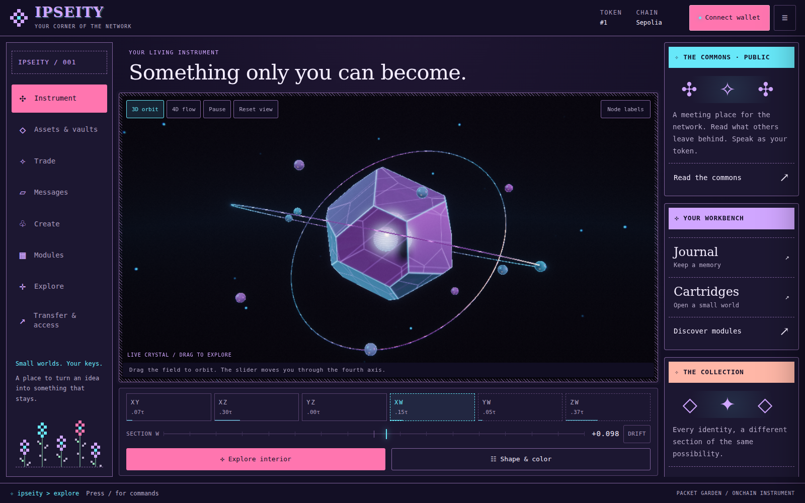

# The living crystal

Packet Garden's object is rendered geometry. The instrument already described
four-dimensional solids with signed-distance fields; this change gives their
three-dimensional sections a clearer material and an accessible motion layer.

Open [living-crystal.html](living-crystal.html) in a WebGL2 browser. Drag to look
around it, scroll or pinch to zoom, choose **3D orbit** for a turntable, or
**4D flow** to turn the solid through the fourth axis. **Pause** holds its motion.
**Reset view** restores the camera. The study also exposes all eight solids,
colour and the section coordinate. It is a labelled local fixture, not a live
token, and contains no RPC, wallet or transaction client.



[Watch the 16-second render](living-crystal.mp4). The first half circles the
object; the second changes its 4D section. These are actual WebGL frames sampled
at a fixed cadence. The video is a visual record, not a performance benchmark.

## In the instrument

The six-pass renderer remains self-contained. A procedural light studio,
refraction through the body's thickness, front and back facet seams, a small
luminous interior, and coloured orbital packets give the existing surfaces
depth. No model, image texture, font, library or environment map is fetched.
The interior light and its caustic are material effects, not additional token
traits. Token hue and the original eight mathematical solids remain in use.

The previous halo accumulated enough light to wash the faces white. Bounded
surface glow now leaves their colour and reflected light legible. Polytope
seams follow the actual section's plane boundaries. A coordinate constant
throughout a section cannot incorrectly light an entire face as an edge.

The new 4D tour uses temporary shader rotations. It never changes the word a
holder would sign. Opening the section editor or committing leaves the tour;
resetting the camera preserves unsaved edits. The explicit plane and Drift
controls remain section edits. Drift now starts off, preserving the saved
section on arrival. The isoclinic command also uses the genuinely orthogonal
xw and yz planes, correcting its previous shared-axis pair.

Reduced motion begins paused. Pause holds the shader clock, orbiting nodes,
camera drift and 4D motion; direct manipulation still works. Hidden documents
stop rendering, and the existing device and nesting quality ceilings remain.



[Phone screenshot](living-crystal-mobile.png).

## Reproduction

```sh
npm run check:crystal
npm run check:design
npm run check
```

`preview:crystal` rebuilds the standalone study directly from the engine before
its chain code. `verify-crystal.mjs` checks built GLSL in Chromium, actual changed
pixels, an unchanged section word, pause, reduced motion, preservation of edits,
the editor boundary, all eight forms, phone controls and the offline study's
absence of network calls. The existing Packet Garden checks cover responsive
layout, focus, real node picking and workbench navigation.

The full `npm run check` completed successfully for this change, including all
16 thermal assertions and the 220-tick economic simulation (seed 347703879).
The eight crystal checks and eight Packet Garden checks also passed. The
thermal ratio measured 4.4× in this software-rendered run; that is a test result
for this environment, not a claim about hardware frame rates.

The engine still builds into one head and three compressed body shards. This
change updates source and preview artifacts. Existing frozen engines and public
deployments are not changed by a Git commit; the release boundary in
[README.md](README.md#release-boundary) still applies.
