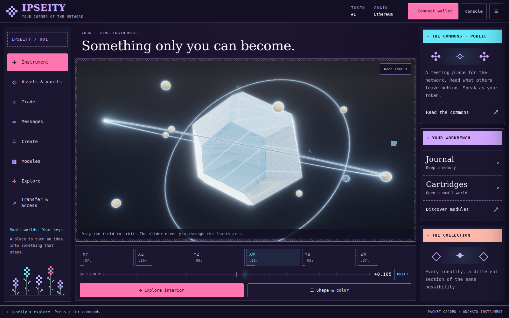
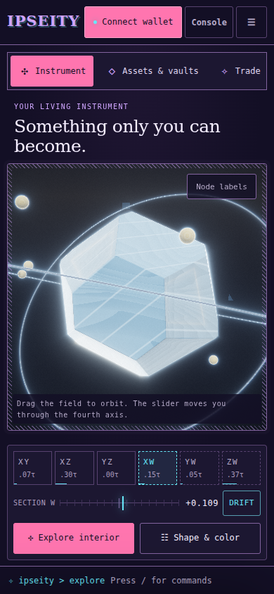
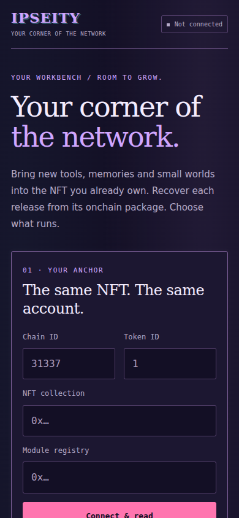
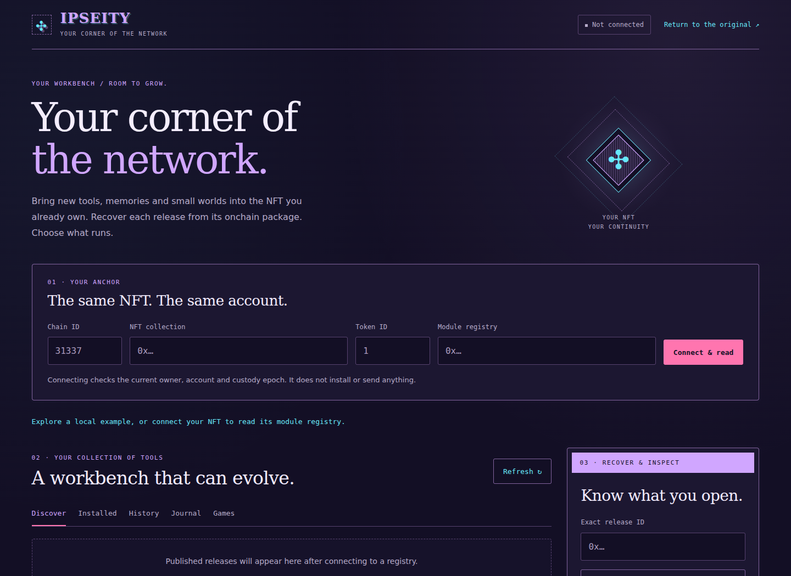
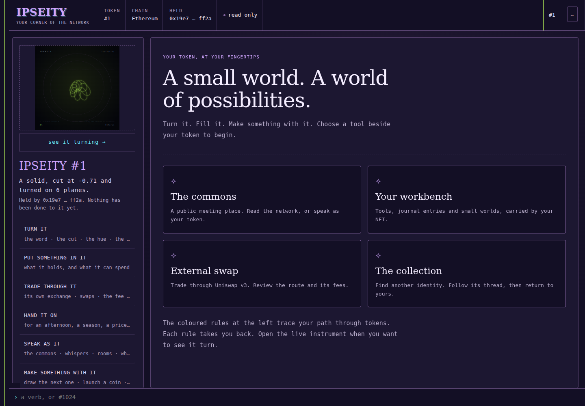
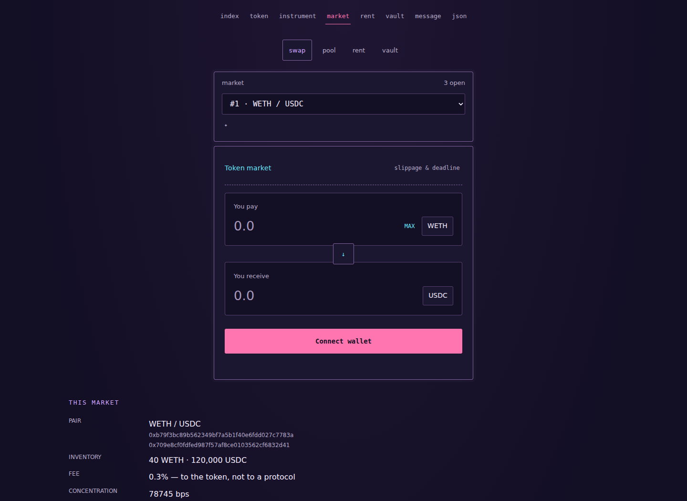

# Packet Garden

The approved retro cypherpunk direction, implemented in IPSEITY's existing
self-contained instrument, token console, Solidity-rendered pages and module
workbench. BBS windows, demoscene colour and small pixel flowers frame the
original onchain artwork. No generated mockup is shipped as the interface.

## Implemented screens

These are Chromium screenshots of the implementation with local preview state.
The instrument uses the existing renderer; the console and market HTML come
from the local contract preview. Wallets are disconnected, and displayed
inventory belongs to the disposable preview fixture, not a public deployment.



| Phone instrument | Phone workbench |
| --- | --- |
|  |  |





The external-swap preview honestly reports that its fixture has no configured
Uniswap venue. It never fabricates a quote or hides the unavailable state:
[desktop](swap-desktop.png), [phone](swap-mobile.png).

## Design system

| Role | Colour |
| --- | --- |
| Background / panels | `#130F25` / `#1C1731` |
| Main / secondary text | `#F4EDFF` / `#B6ABC9` |
| Reading and links | `#67E8F9` |
| Identity and headings | `#D0A6FF` |
| Primary action | `#FF75AF` |
| Caution / success / error | `#FFC46B` / `#94E2B5` / `#FF8E9D` |

System serif headings sit above readable system text and monospace controls.
Thin lilac rules, 3–4 px corners and still CSS ornaments replace the previous
mixed gold, black and blue skins. No external fonts, images, UI library or
additional application dependency is required. Token hue continues to colour
the artwork and console identity rules; it does not change semantic colours.

## Behaviour

- The instrument has a permanent navigation rail, commons and workbench cards,
  a focus view with an explicit return, optional node labels and a command strip.
- Navigation replaces the document. It does not embed another live application
  beside the renderer. Existing explicit nesting retains its pacing limits.
- The framed canvas measures its origin for pointer input. Projected labels use
  the same focal length as the shader and picking ray.
- Mobile navigation scrolls horizontally. Small nested views retain the artwork
  and command strip. Wallet, command and exit controls remain reachable.
- Shape choices are keyboard buttons; the closed tool sheet is inert. Reduced
  motion and existing confirmation steps remain respected.
- The journal and cartridge cards open the current token's workbench tab.
  Fragment changes select views only; they never prepare or send a transaction.
- External swaps are labelled Uniswap v3, with fees to its liquidity providers.
  The NFT's separate exchange is labelled Token market and retains its fee facts.
- Public commons, encrypted journal metadata and signing reviews retain their
  existing meanings. No sample messages, balances or privacy claims are added.

## Verification

```sh
npm ci
npm run check:design
node tools/compile.mjs
npm run test:modules
npm run test:modules:browser
npm run test:modules:native
npm run check
```

`check:design` builds both documents and tests 1600, 900, 390 and 320 px layouts,
focus/exit, actual node clicks, label visibility, command access and workbench
fragment navigation. The other browser suites exercise the installed module,
journal, account and cartridge boundaries on disposable local fixtures.

The shared Chrome contract fits EIP-170 at 23,141 bytes. The 82 module tests,
five browser fixture scenarios and five native workbench scenarios passed;
the native rehearsal checked 11 explicitly reviewed local transactions.

The existing thermal suite's idle/moving ratio assertion also fails against
unmodified `ccdae7e` in this software-rendered environment (3.8× versus its >4×
threshold). Its other 15 checks pass, including hidden-page suspension and
nested-renderer pacing. Renderer throttle constants and financial contracts
are unchanged by this redesign. This baseline limitation is reported rather
than lowering the threshold to obtain a green result.

## Release boundary

This branch changes source and build outputs. It sends no public-chain
transaction. The artwork engine, console stores, site contracts and immutable
module workbench are separate deployment paths. Publishing a site alone does
not replace a frozen engine or an existing immutable workbench. Build and review
the corresponding new deployment artifacts through the project's existing
release process before making the new interface live.
